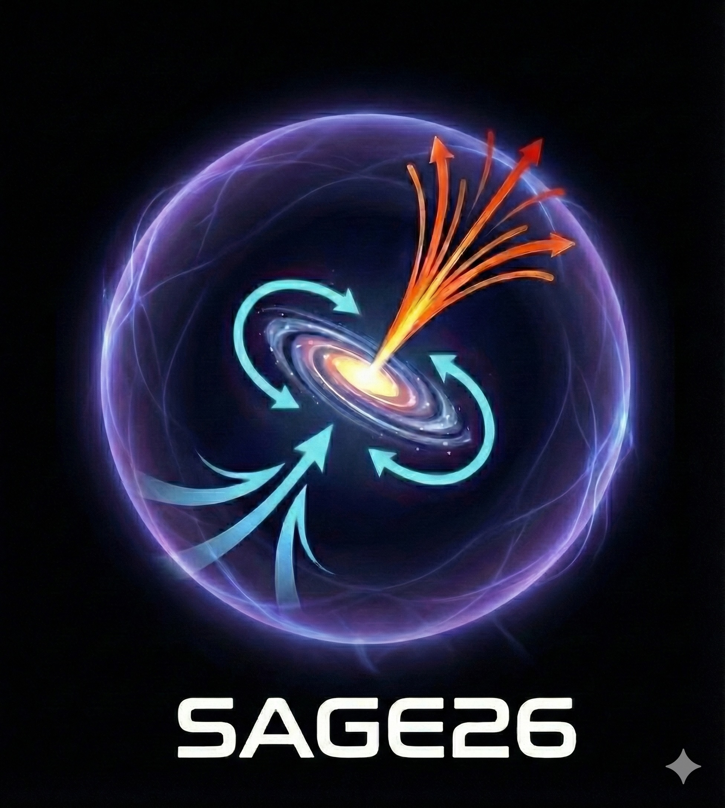
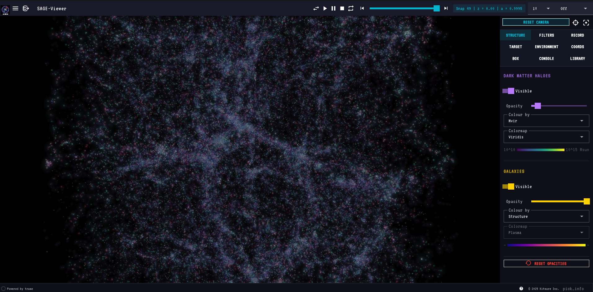
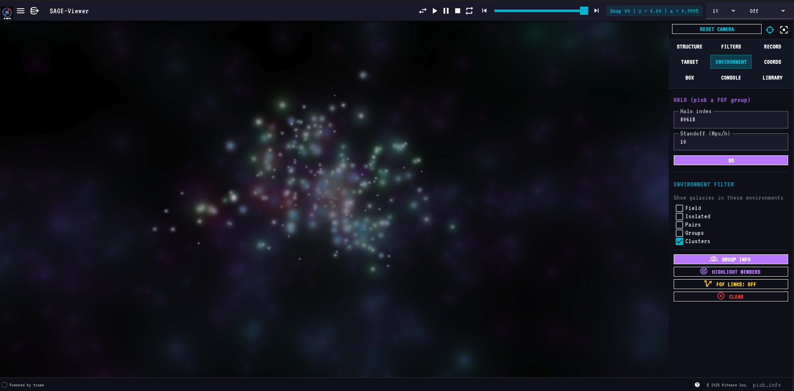

<p align="center">
  
</p>

# SAGE-Viewer

An interactive 3D visualization package for [SAGE26](https://github.com/MBradley1985/SAGE26) semi-analytic galaxy formation outputs.

Renders dark matter haloes and SAGE galaxies together in a browser-based interactive viewer powered by [PyVista](https://pyvista.org) and [Trame](https://kitware.github.io/trame/).



## Features

### Rendering
- World-space gaussian splat rendering of haloes and galaxies — splats scale with camera distance and stay physically meaningful at any zoom
- **Structure** render mode: each galaxy drawn as a layered composition — cold-gas envelope (blue, sized by ColdGas) + outer envelope (green for CGM-regime sized by CGMgas, red for Hot-regime sized by HotGas)
- 27 selectable matplotlib colormaps, identical lists for halo and galaxy layers
- Live colormap, colour-by mode, opacity and visibility controls per layer
- Colour-by dropdowns are model-aware — only modes whose underlying field is present in the loaded model appear in the list; they update automatically on model switch
- Full still-quality rendering at all times — no resolution drop during camera drag or playback



### Playback & camera
- Play / Pause / Stop / Reverse / Repeat transport at 0.1× – 5× speeds
- Continuous camera rotation (CW / CCW at 15° / 30° / 60° per second)
- Reset / Centre / Focus buttons
- Fly to halo, galaxy, coordinates, or sub-box (with focus mode that masks everything outside)
- **Draw Sphere** (Coords tab): place a live two-handle sphere in the viewport — drag the centre ball to translate, drag the edge ball to resize; **Lock Sphere** commits it as the active focus region
- **Draw Box** (Box tab): place a live resizable box widget — drag any face or corner handle; **Lock Box** commits it; **Clear** on both tabs cancels the widget without navigating
- Switching models always lands at z=0 of the new model; slider and snap chip update immediately
- Camera bookmarks (save, restore, delete)

### Selection & inspection
- **Galaxy Info** panel (Target tab) — GalaxyID, type, halo Mvir, stellar mass, sSFR, cold gas, B/T, BH mass, H2 mass, gas regime, FFB regime, environment classification, mass-weighted stellar age
- **Group Info** panel (Environment tab) — FOF-aggregate stats: classification, member breakdown (centrals vs satellites), host Mvir, total stellar / cold gas / SFR, mean B/T, spatial extent, target role, BCG stellar mass
- **Highlight Galaxy** / **Highlight Members** buttons add regime-coloured splat overlays — CGM-regime members in dodgerblue, Hot-regime in tomato; the selected galaxy is marked with a white border ring
- **Double-click any point** in the viewport (any tab) to populate the Target tab's halo + galaxy IDs and draw a red marker on the selection. Only currently visible galaxies (passing all filters and focus) are selectable. If Focus is active, the camera carries to the new selection at the last-used radius.
- **Enter to run** in every input field — Halo idx, Galaxy idx, Coords X/Y/Z, Box bounds, Console command, script path, screenshot/movie label all submit on Enter, equivalent to clicking the paired Go / Zoom / Run / Take Screenshot button


### Filtering
- Halo filters: Mvir (log10), Rvir (Mpc/h), Vvir (km/s)
- Galaxy filters: stellar mass, sSFR, B/T, age, BH mass, ICS mass, type (centrals / satellites), FFB regime, CGM / Hot regime, environment class (Field / Isolated / Group / Cluster, via checkboxes in the Environment tab)
- Filters are **active-only** — a slider sitting at its full-range endpoints has no effect; move it inward to filter. Every galaxy with detectable mass is visible at startup.
- Filters auto-disable when the loaded model doesn't contain the underlying field
- Reset Filters button restores defaults
- **FoF links are filter-aware** — satellite→central gold lines are only drawn for halos that pass the active filter mask, focus sphere/box, and the halos-visible toggle; they stay correct during playback and recording
- **Playback respects all scene state** — the pre-render frame cache is keyed on filter values, focus region, layer visibility/opacity/color-mode, and FoF state; changing any of these and pressing Play again always produces fresh frames

### Side-by-side multi-box comparison
- Load two or more SAGE models side-by-side in a single viewport with `+SBS` in the Models section of the hamburger menu
- Each box is fully independent: its own snapshot, filters, colormaps, opacity, and visibility settings
- A box strip at the bottom of the viewport shows all loaded boxes; click any box label to make it active — the entire right panel (Structure, Filters, Target, Console, …) then controls that box
- Active box label is **green**; idle boxes are **white**
- Play, step, and the snapshot slider advance only the active box's snapshot
- Rotation is disabled in multi-box mode (all boxes share one camera; independent rotation is not supported)
- Halo Mvir colour mode is always locked to Viridis; the colormap selector is greyed out when Mvir is selected
- CLR button in the box strip resets that box to its defaults without affecting others

### Multi-model (overlays)
- Auto-scans `<sage_root>/output/` for SAGE model subfolders
- Switch the primary model from the hamburger menu (any box size)
- Overlay a second compatible model on top (same box size + snap count)
- Loading spinner during model swaps; warning snackbar for incompatible overlays

### Output
- Screenshots in PNG / JPG / TIFF
- Movie recording in GIF / MOV (H.264, via ffmpeg) / PNG sequence
- Configurable FPS (1 – 60) and resolution (Native / 2× / 4× supersampled)
- Optional user-typed label per capture; everything goes into a single session folder per app launch

### Launch Mode wizard
- Guided setup flow for configuring and launching SAGE26, accessible from the top-left Launch Mode menu or the Explore Mode hamburger
- Step chips in the header track progress (cyan = current step, green = done, white = pending)
- **Rescan** button re-runs the environment scan from scratch at any point
- **Create config file** option generates a new `.par` from the built-in millennium.par template; choose a custom filename before writing
- Par file editor opens side-by-side with the terminal when a `.par` file needs editing — both panels visible simultaneously
- Wizard always resets cleanly when reopened from Explore Mode

<!-- Console screenshot: drop docs/images/console.png here once captured -->

### Embedded console (Console tab)
- **Terminal mode** — a live xterm.js terminal backed by a real PTY (`$SHELL -l`); full ANSI colour, cursor control, and interactive programs (`vim`, `top`, `htop`, `less`) all work
- **SAGE command mode** — natural-language SAGE commands (`show only clusters`, `go to halo 42`, `snap 30`, `screenshot`, …); switch via the **SAGE Cmds** button, `terminal` returns to the shell
- **Multiple sessions** with a `+` button — each console has its own PTY process and command history
- **Pop-out** floats a movable / resizable console card over the viewport so you can keep typing while watching the render

### Self-contained metadata
- Cosmology (h, Ω_m, Ω_Λ), box size, and snapshot redshifts are read directly from `model_0.hdf5`'s `Header/Simulation`
- The `.par` file is now only needed for tree-file paths

## Supported simulations

| Simulation | Box size | Snapshots | Tree format |
|---|---|---|---|
| miniMillennium | 62.5 Mpc/h | 64 | lhalo_binary |
| microUchuu | 96 Mpc/h | 50 | lhalo_binary |

Both supported automatically — point at the `.par` file and SAGE-Viewer figures out the rest from the HDF5.

## Quick start

```bash
git clone https://github.com/MBradley1985/SAGE-Viewer
cd SAGE-Viewer
pip install -e .
sage-viewer --par /path/to/millennium.par
```

> **Note:** PyPI publishing is coming with v1.0. Until then, install from source as above.

Open the printed URL in any browser. To launch on a remote cluster and view locally, use SSH port-forwarding:

```bash
# On the cluster
sage-viewer --par millennium.par --port 8080

# In a local terminal
ssh -L 8080:localhost:8080 user@cluster
# Then open http://localhost:8080 in your browser
```

## Command-line options

```text
--par FILE              Path to a SAGE .par file (required)
--par-dir DIR           Directory to scan for additional .par files
                        (defaults to the parent of --par; used for the
                        multi-model dropdown)
--snap N                Initial snapshot number (default: last = z=0)
--port N                Trame server port (default: 8080)
--n-jobs N              Worker threads for parallel halo file reads
--max-halos N           Downsample ceiling per snapshot
--max-galaxies N        Downsample ceiling per snapshot
--min-halo-mass MSUN    Minimum halo mass to load
--min-stellar-mass MSUN Minimum stellar mass to load
```

## Multi-model workflow

If your SAGE root looks like:

```
SAGE26/
├── input/
│   ├── millennium.par
│   ├── millennium_vanilla.par
│   └── microuchuu.par
└── output/
    ├── millennium/model_0.hdf5
    ├── millennium_vanilla/model_0.hdf5
    └── microuchuu/model_0.hdf5
```

then `sage-viewer --par input/millennium.par` discovers all three models automatically. Click the hamburger icon (top-left) → Models section to switch, or click "+ overlay" next to a compatible model to render both at once.

## Installation

```bash
# From source (PyPI release coming with v1.0)
git clone https://github.com/MBradley1985/SAGE-Viewer
cd SAGE-Viewer
pip install -e ".[dev]"
```

Requires Python ≥ 3.10. Movie recording in MOV format requires `ffmpeg` in your `PATH`.

### HPC / supercomputer

A helper script is included for module-system clusters (Slurm, PBS, etc.):

```bash
# Load a Python module first (name varies by cluster)
module load python/3.12.0

# Create a venv and install SAGE-Viewer in one step
./install_hpc.sh

# Optional: place the venv on scratch for faster I/O
./install_hpc.sh /scratch/$USER/sage-viewer-env
```

The install is editable (`pip install -e .`) so a `git pull` updates the code immediately with no reinstall. `ffmpeg` is checked separately — load it via your module system if you need MOV recording.

Then in every session:

```bash
source .venv/bin/activate
sage-viewer --par /path/to/millennium.par --port 8080
# SSH-tunnel the port to your local browser
```

## Documentation

Full documentation at [sage-viewer.readthedocs.io](https://sage-viewer.readthedocs.io/en/latest/).

## Tabs at a glance

When multiple boxes are loaded a **box strip** appears at the bottom of the viewport. Click any box to make it active (green label). All tab controls then target that box.

| Tab | Purpose |
|---|---|
| Structure  | Layer visibility, opacity, colour-by mode, colormap (with inline colorbar) |
| Filters    | Range sliders for halo and galaxy properties |
| Record     | Screenshots and movie recording |
| Target     | Halo / galaxy navigation, focus zoom, Galaxy Info, Highlight Galaxy |
| Environment| Halo selector, environment-class checkboxes, Group Info, Highlight Members |
| Coords     | Fly to arbitrary (x, y, z) — "Use Current Position" populates from camera; **Draw Sphere** places an interactive two-handle sphere (drag centre ball to translate, drag edge ball to resize); **Lock Sphere** commits it as the focus region |
| Box        | Zoom to axis-aligned sub-box — "Use Current View" populates from camera; **Draw Box** places a resizable interactive box; **Lock Box** commits it as the focus region |
| Console    | Live xterm.js shell terminal (PTY-backed) + SAGE natural-language command mode. Multiple sessions, pop-out window |
| Library    | Browse stored screenshots / movies; double-click a row to open as a movable, resizable floating card over the viewport (multiple items open simultaneously); per-row delete button removes the file from disk immediately |


<!-- Library pop-out screenshot: drop docs/images/library_popup.png here once captured -->

The **Focus button** (top of the right panel) is tab-aware: it focuses on whatever's active in the current tab (target galaxy, environment halo, coords point, or box region).

## License

MIT — see [LICENSE](LICENSE).
